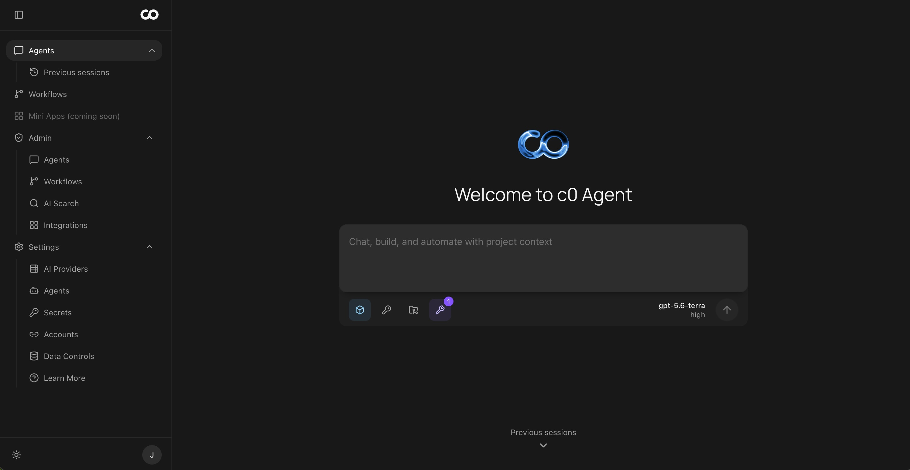

# SolZero

Give your work an agent. 

SolZero Agent is low-cost, low-maintenance, scalable, and durable. Deploy it in minutes to your 
Cloudflare account and focus on work that matters.

## What Makes SolZero Different?

### SolZero Agent Harness

SolZero Agent is a custom harness built on Cloudflare Workers and Durable Objects. It is the default
runtime for everyday work, with low startup overhead and no container to provision for each
session. [Cloudflare Workers](https://developers.cloudflare.com/workers/reference/how-workers-works/)
run globally and bill for requests and active CPU time rather than wall-clock duration, which makes
the Isolate harness a strong fit for interactive and event-driven agent work.

Built-in context compaction and searchable durable conversation history keep long-running sessions
focused and efficient. Skills and MCP tools bring organizational context into the agent when it is
needed. Sub-agents scale out dynamically as independent, durable SolZero Agent instances without
provisioning another container.

### Full sandboxes for deeper work

Some tasks need a complete development environment. SolZero also supports sandboxed OpenCode, Codex,
and Claude Code agents with a full Linux filesystem and shell. These runtimes have more startup and
resource overhead than SolZero Agent, but they are a better fit for deep coding and other work that needs
full system access.

### Workflows for deterministic and agentic automation

Workflows are one of our favorite parts of SolZero. They are fast to build, easy to adapt to a team's
processes, and useful for weekly reports, day-to-day operations, proactive automation, and reactive
incident workflows.

SolZero Workflows combine deterministic nodes with non-deterministic agent steps. They run on Cloudflare
Workflows and support durable execution, schedules, webhooks, human-in-the-loop approvals, session
reuse, and response caching. Reusing a session or cached response can reduce repeat model calls,
latency, and token spend.

## Integrations

SolZero includes code for these integrations:

- Better Auth supports credential and social sign-in. Generic OIDC support includes Okta
- LLM Providers
  - Cloudflare AI Gateway. Includes free credits for GPT OSS 120B, along with GPT 5.6 Luna, GPT 5.6 Sol, Claude Opus 5, and Grok 4.5 as pre-configured models
  - LiteLLM
- MCP support covers servers, skills, and MCP Context Forge
- GitHub Apps and Slack connect SolZero to development and team workflows
- Cloudflare AI Search can use built-in content, R2 objects, or websites. Administrators can manage these sources from the Admin dashboard. Cloudflare AI Search stores the search index

Deployment owners store non-secret platform settings in a JSONC file for each stage. Administrators can manage other integration settings at runtime from the Admin dashboard. Values in the stage file have priority, which makes required settings clear during review.

## Tech stack

- Cloudflare Workers, Durable Objects, Workflows, Containers, D1, KV, R2, and AI Search
- Effect for the backend API service
- TanStack Start and Kumo for the web app
- Better Auth for sign-in
- Alchemy v2 for infrastructure as code
- Nub for package management

See [docs/system-diagram.md](docs/system-diagram.md) for the system architecture.

## Get started

### Prerequisites

- Node.js 24.15.x. The repository's `.nvmrc` and package metadata are the source of truth.
- [Nub](https://nubjs.com/) 0.4.11
- A Docker-compatible CLI with an active engine
- A Cloudflare account with the Workers Paid plan. The complete SolZero stack creates Cloudflare Containers.

### Set up a local environment

Install Nub, and then install the locked dependencies:

```sh
curl -fsSL https://nubjs.com/install.sh | bash
nub install --frozen-lockfile
```

Create the ignored local environment files:

```sh
cp config/.env.example config/.env
cp config/.dev.vars.example config/.dev.vars
```

Add `CLOUDFLARE_ACCOUNT_ID` and `CLOUDFLARE_API_TOKEN` to `config/.env`. Infrastructure tools read this file. Keep it untracked. Use `config/.dev.vars` only for secrets referenced by the dev profile.

The deployment token needs the account `API Tokens > Write` permission, plus edit access for AI Gateway and Secrets Store. Alchemy uses these permissions to create the runtime token, BYOK resources, and the other SolZero resources.

Edit `config/dev.config.jsonc` before you sign in:

1. In `admins.adminEmails`, replace `admin@example.com` with your email address.
2. Keep `deployment.zone` set to `localhost` for local work.
3. Review the Cloudflare AI Gateway model allowlist and its default model.
4. Keep optional LiteLLM, MCP Context Forge, GitHub, Slack, and external auth blocks disabled until you are ready to configure them.

Each stage has a complete profile:

- `config/dev.config.jsonc`
- `config/test.config.jsonc`
- `config/pre.config.jsonc`
- `config/prod.config.jsonc`

An ephemeral `pre-*` stage uses the pre profile. Each profile stands alone and contains all non-secret settings for its stage. Secret fields hold explicit environment references.

To store a provider key in Cloudflare Secrets Store, uncomment its `providerKeys` reference in the stage JSONC file. After that edit, set the matching `S0_CONFIG_SECRETS_CF_AI_GATEWAY_*_API_KEY` value in the stage vars file.

A deployment reference locks that provider in Admin. For an unlocked provider, an administrator can store an encrypted global key in Admin. Each user can set an OpenAI, Anthropic, or xAI override from Settings > AI Providers.

Cloudflare resolves credentials in this order:

1. The user key or global Admin key for the request
2. The default BYOK key on the gateway
3. Unified Billing credits when that mode is active

Validate every profile:

```sh
nub run config:check
```

The default security keys and administrator password use `generateIfMissing`. Alchemy creates and stores them when their entries in `config/.dev.vars` are empty or omitted.

When you enable an integration, uncomment each required secret in `config/.dev.vars` and add its value. If a required secret is missing, SolZero stops before startup and reports the environment variable name.

After your credentials select the intended Cloudflare account, start SolZero:

```sh
set -a
source config/.env
set +a
nub exec wrangler whoami
nub run dev
```

The web app runs at <http://localhost:3000>. The API Worker runs at <http://localhost:1337>.

In another terminal, check the control plane and get the generated administrator password:

```sh
curl --fail-with-body http://localhost:1337/health
nub run auth:admin-password -- dev --local
```

Open <http://localhost:3000>. Sign in with an address from `admins.adminEmails` and the generated password.

Create an Isolate, OpenCode, or Codex session. Select a compatible Cloudflare AI Gateway model, and then send a prompt. Configure LiteLLM in Admin when you need more models. Repository-backed sessions require a linked GitHub account.

### Deploy to Cloudflare

The production profile derives `https://ai.<zone>` for the web app and `https://api.ai.<zone>` for the API by default. Set `deployment.webFqdn` or `deployment.apiFqdn` to use explicit hostnames. Both hostnames must belong to the configured Cloudflare zone.

Create the production secrets file:

```sh
cp config/.dev.vars.example config/.prod.vars
```

Prepare the production profile:

1. Set `deployment.zone` in `config/prod.config.jsonc` to your Cloudflare-managed zone.
2. Add explicit `deployment.webFqdn` and `deployment.apiFqdn` values when you need custom hostnames.
3. Replace `admin@example.com` with the production administrator email.
4. Enable the external integrations that you are ready to configure.
5. Uncomment the matching secrets in `config/.prod.vars`, and then add their values.

Validate the profiles:

```sh
nub run config:check
```

Review the planned resources:

```sh
nub run infra:plan:prod
```

Confirm that the plan uses the intended account, zone, and resource names. Start the deployment after this check:

```sh
nub run infra:deploy:prod
```

The first Container deployment can take several minutes after the Workers become available. Get the administrator password and check the public routes:

```sh
nub run auth:admin-password -- prod
curl --fail-with-body https://api.ai.<zone>/health
curl --fail-with-body https://ai.<zone>/api/auth/config
```

Open `https://ai.<zone>`. Sign in with the production administrator email. Configure the model gateway, and then repeat the local SolZero Agent smoke test.

When your deployment uses sandbox agents, test its selected OpenCode, Codex, or Claude Code Container runtime.

For a preview deployment, use `config/pre.config.jsonc` and `config/.pre.vars`. Run `nub run infra:plan:pre`, followed by `nub run infra:deploy:pre`.

SolZero validates the `dev`, `test`, `pre`, and `prod` profiles. Keep every profile in the repository to preserve this contract.

## Common commands

```sh
nub run dev                 # API Worker and web app
nub run dev:api             # API Worker only
nub run dev:web             # web app only
nub run config:check        # validate every config profile and generated schema
nub run test                # workspace and repository tests
nub run typecheck           # repository type checks
nub run lint                # repository lint checks
nub run format              # formatting check
```

Run the local API key end-to-end test after you create a user API key:

```sh
S0_API_KEY="<user API key>" \
BACKGROUND_BASE_URL=http://localhost:1337 \
nub run test:e2e
```

## Roadmap

- Dynamic Sites
- Teams
- Workflow evaluation support
- A public documentation site
- Code Mode fixes
- UI polish
- Dynamic Container support for each Cloudflare account plan
- Self managing updates, system checks, etc
- Creative
  - screenshots of login page and other notable pages
    - is video possible? For each notable UX point, such as login, agent use, workflow use, etc.
    - Would this use Takumi or kitesurf?
  - systems diagram generation with Takumi

## License

Copyright (C) 2026 SolZero

SolZero uses the GNU Lesser General Public License v3.0-only. Full terms appear in [COPYING](COPYING), [COPYING.LESSER](COPYING.LESSER), and [THIRD_PARTY_NOTICES.md](THIRD_PARTY_NOTICES.md).
