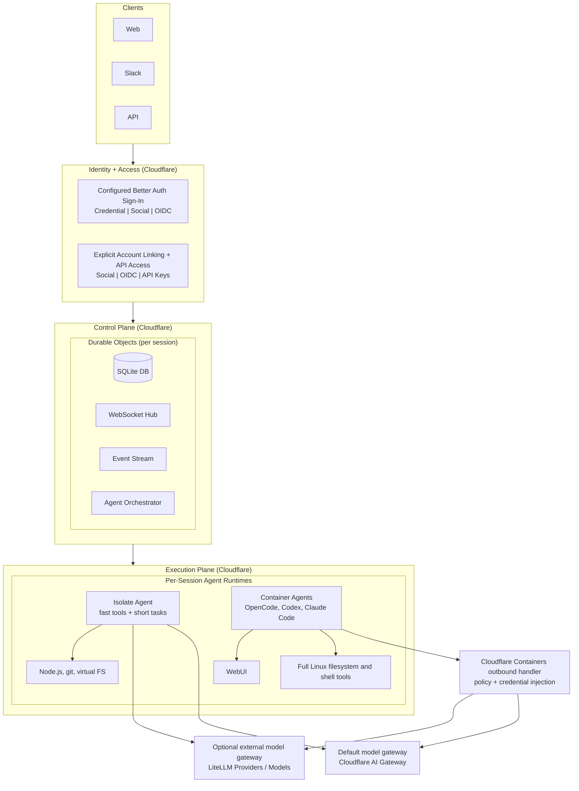

# System diagram

Architecture overview (Mermaid).

```mermaid
flowchart TB
  subgraph Clients["Clients"]
    Web[Web]
    Slack[Slack]
    API[API]
  end

  subgraph Identity["Identity + Access (Cloudflare)"]
    SignIn["Configured Better Auth Sign-In\nCredential | Social | OIDC"]
    AccountLink["Explicit Account Linking + API Access\nSocial | OIDC | API Keys"]
  end

  subgraph ControlPlane["Control Plane (Cloudflare)"]
    subgraph DO["Durable Objects (per session)"]
      direction LR
      SQLite[(SQLite DB)]
      WSHub[WebSocket Hub]
      EventStream[Event Stream]
      AgentOrch[Agent Orchestrator]
    end
  end

  subgraph ExecutionPlane["Execution Plane (Cloudflare)"]
    subgraph Runtimes["Per-Session Agent Runtimes"]
      IsolateAgent["Isolate Agent\nfast tools + short tasks"]
      SandboxAgent["Container Agents\nOpenCode, Codex, Claude Code"]
      WebUI[WebUI]
      IsolateTools["Node.js, git, virtual FS"]
      SandboxTools["Full Linux filesystem and shell tools"]
    end
  end

  CloudflareAIGateway["Default model gateway\nCloudflare AI Gateway"]
  LiteLLM["Optional external model gateway\nLiteLLM Providers / Models"]
  ContainerOutbound["Cloudflare Containers outbound handler\npolicy + credential injection"]

  Clients --> Identity
  Identity --> ControlPlane
  ControlPlane --> ExecutionPlane
  IsolateAgent --> CloudflareAIGateway
  IsolateAgent --> LiteLLM
  SandboxAgent --> ContainerOutbound
  ContainerOutbound --> CloudflareAIGateway
  ContainerOutbound --> LiteLLM

  IsolateAgent --> IsolateTools
  SandboxAgent --> SandboxTools
  SandboxAgent --> WebUI
```
