# SolZero system diagram

The image gives a presentation view of the service map. The Mermaid source below shows the exact request and data paths.

Solid arrows show request and data paths. Dashed arrows show optional integrations or implementation links.

```mermaid
flowchart TB
  subgraph Entrypoints["Entrypoints"]
    direction LR
    WebEntry["Web app<br/>browser users"]
    ApiEntry["API<br/>API keys and automation"]
    McpEntry["MCP<br/>SolZero runtimes and authorized clients"]
    EventEntry["Events<br/>webhooks and schedules"]
  end

  subgraph Cloudflare["Cloudflare account"]
    direction TB

    subgraph Edge["Edge applications"]
      direction LR
      WebWorker["Web Worker<br/>Website.Vite + TanStack Start SSR"]
      ApiWorker["API Worker<br/>routing + request telemetry"]
      HttpApi["Effect HttpApi<br/>REST + OpenAPI"]
      BetterAuth["Better Auth<br/>credential + social + OIDC"]
      McpRoutes["MCP routes<br/>/mcp<br/>/mcp/workflows<br/>/integrations/mcpcf/mcp"]
      RealtimeRoutes["Realtime and event routes<br/>WebSocket + workflow + webhook"]
    end

    subgraph Execution["Durable execution"]
      direction LR
      SessionDO["SessionDO<br/>orchestration + events + WebSocket"]
      IsolateDO["IsolateSessionAgent + sub-agents<br/>Workers + Durable Object SQLite"]
      ContainerDO["Agent Container Durable Objects<br/>lifecycle + outbound policy"]
      Containers["Container Platform<br/>OpenCode + Codex + Claude Code"]
      ContainerOutbound["Container outbound handler<br/>host policy + credential injection"]
      DynamicWorkflow["Cloudflare Workflows<br/>DynamicUserWorkflow"]
      WorkflowAlarm["WorkflowAlarmDO<br/>scheduled workflow dispatch"]
    end

    subgraph Data["Data and content"]
      direction LR
      D1[("D1<br/>auth + sessions + workflows + metadata")]
      KV[("KV namespaces<br/>runtime config + registries + caches")]
      R2[("R2 buckets<br/>workflow artifacts + skills + AI Search content")]
    end

    subgraph AiServices["AI services"]
      direction LR
      AiGateway["Cloudflare AI Gateway<br/>default model gateway + telemetry"]
      WorkersAI["Workers AI<br/>Gateway-backed models"]
      AiSearch["Cloudflare AI Search<br/>global + workflow namespaces"]
      BrowserRendering["Browser Rendering<br/>website ingestion for AI Search"]
    end

    subgraph Platform["Platform services"]
      direction LR
      SecretsStore["Secrets Store + Provider Keys<br/>gateway BYOK credentials"]
      RateLimit["Rate Limiting<br/>credential sign-in"]
      Observability["Workers Observability<br/>Effect logs + spans + request telemetry"]
    end
  end

  subgraph ThirdParty["Third-party integrations"]
    direction LR
    ModelProviders["Model providers<br/>OpenAI + Anthropic + xAI + others"]
    LiteLLM["LiteLLM<br/>optional OpenAI-compatible model gateway"]
    Mcpcf["MCP Context Forge<br/>optional server registry + tool proxy"]
    CustomMcp["Custom MCP servers"]
    GitHub["GitHub App"]
    Slack["Slack"]
    Identity["Identity providers<br/>GitHub + Okta/OIDC + social"]
  end

  subgraph Stack["Tools and frameworks"]
    direction LR
    WebStack["Web<br/>React + TanStack Start/Router<br/>Kumo UI + Tailwind + Vite"]
    ApiStack["Backend<br/>TypeScript + Effect + Effect HttpApi<br/>Better Auth + Drizzle ORM + MCP SDK"]
    AgentStack["Cloudflare AI stack<br/>Agents SDK + Think + Shell + Code Mode<br/>Dynamic Workflows + Containers + Workers AI provider + AI SDK"]
    DeliveryStack["Delivery and quality<br/>Alchemy v2 + Nub + Turbo + Wrangler<br/>Oxc: Oxlint + Oxfmt<br/>TypeScript + Vitest"]
  end

  WebEntry --> WebWorker
  WebWorker -->|"/api/* server-side proxy"| ApiWorker
  ApiEntry --> ApiWorker
  McpEntry -->|"MCP routes"| ApiWorker
  EventEntry --> ApiWorker

  ApiWorker --> HttpApi
  ApiWorker --> BetterAuth
  ApiWorker --> McpRoutes
  ApiWorker --> RealtimeRoutes
  BetterAuth --> RateLimit

  HttpApi --> SessionDO
  RealtimeRoutes --> SessionDO
  HttpApi --> DynamicWorkflow
  WorkflowAlarm --> DynamicWorkflow
  DynamicWorkflow --> SessionDO

  SessionDO --> IsolateDO
  SessionDO --> ContainerDO
  ContainerDO --> Containers
  Containers --> ContainerOutbound

  HttpApi --> D1
  HttpApi --> KV
  HttpApi --> R2
  McpRoutes --> D1
  McpRoutes --> KV
  SessionDO --> D1
  DynamicWorkflow --> D1
  DynamicWorkflow --> KV
  DynamicWorkflow --> R2

  IsolateDO --> AiGateway
  ContainerOutbound --> AiGateway
  AiGateway --> WorkersAI
  AiGateway --> ModelProviders
  SecretsStore --> AiGateway

  IsolateDO -. "optional model path" .-> LiteLLM
  ContainerOutbound -. "optional model path" .-> LiteLLM
  LiteLLM --> ModelProviders

  IsolateDO --> McpRoutes
  ContainerOutbound --> McpRoutes
  McpRoutes --> AiSearch
  McpRoutes --> DynamicWorkflow
  McpRoutes -. "optional proxy" .-> Mcpcf
  Mcpcf --> CustomMcp
  IsolateDO -. "configured server" .-> CustomMcp
  Containers -. "configured server" .-> CustomMcp
  R2 --> AiSearch
  BrowserRendering --> AiSearch

  BetterAuth <--> Identity
  ApiWorker <--> GitHub
  ApiWorker <--> Slack

  WebWorker -.-> Observability
  ApiWorker -.-> Observability
  SessionDO -.-> Observability
  IsolateDO -.-> Observability
  DynamicWorkflow -.-> Observability

  WebStack -. "implements" .-> WebWorker
  ApiStack -. "implements" .-> HttpApi
  AgentStack -. "implements" .-> IsolateDO
  AgentStack -. "implements" .-> Containers
  DeliveryStack -. "deploys and validates" .-> WebWorker
  DeliveryStack -. "deploys and validates" .-> ApiWorker
```

